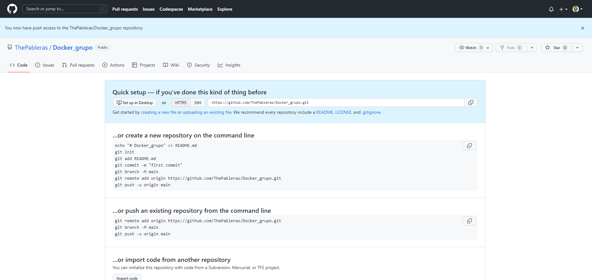

# Ejercicios Docker Grupo
> Realizado por: Emilio Taibo

## Miercoles 01/02/2023

- Recibí la invitación de Pablo a las 9:55 del 01/02/23 y la acepte a las 10:00.

- A las 10:27 hice mi rama

- A las 10:44 nos comemzamos a hacer los ejercicios
- A las 10:47 preparo el markdown de los ejercios con todos los enunciados
- A las 10:50 acabé el primer ejercicio
- A las 11:08 acabé el segundo ejercicio

