# Ejercicio Docker grupo
> Realizado por Pablo R.

## Miercoles - 01/02/2023
- A las 9:57 del 01/02/2023 creo un repositorio con el nombre Docker_grupo e invito a mis compañeros Patricia y Emilio.
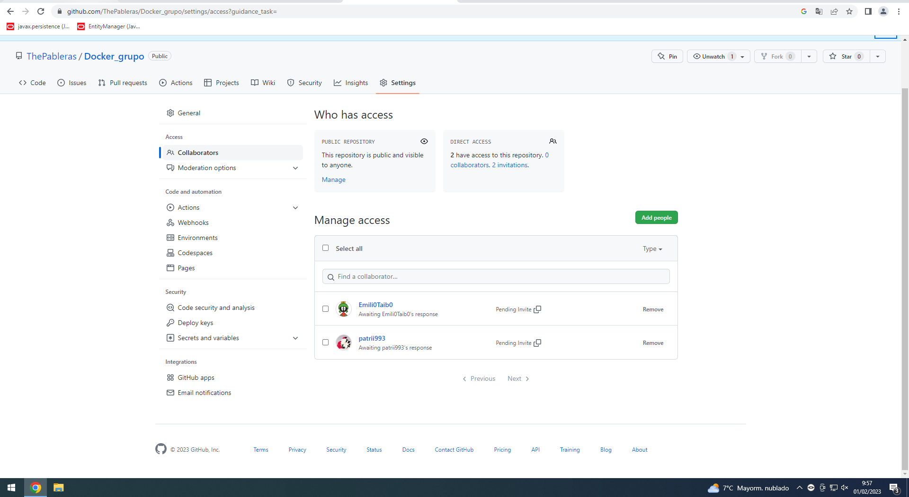

- A las 10:10 creo mi archivo personal de daily. La estructura es DAILY/participante. Pudiendo contener su carpeta assets para imagenes.

- A las 10:15 verifico que mis compañeros ya han aceptado la peticion de colaboración en el repositorio.
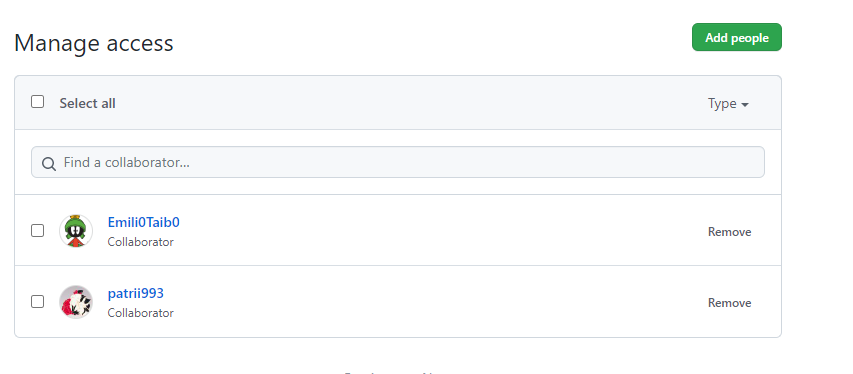

- A las  10:20 Patricia me notifica que va a solucionar un fallo relativo al main. Ha creado por error una carpeta denominada "Nueva carpeta".

- A las 10:26 nos ponemos de acuerdo para crear la estructura de los ejercicios. Consistirá en una carpeta EJERCICIOS que contendrá el conjunto de estos, estructurados por diferentes temas. El tema 1 se guardará en EJERCICIOS/EJERCICIO1, estando sus imagenes en una subcarpeta assets.

- A las 10:23 nos ponemos de acuerdo para el reparto del trabajo. En un principio yo haré el ejercicio1, Patricia el ejercicio2 y Emilio el ejercicio3.

- A las 10:40 después de preguntarle a Inés unas dudas relativas al uso de Git nos disponemos a comenzar nuestra parte del ejercicio.

- A las 10:45 me niego a responder preguntas a mis compañeros relativa a los ejercicios si no es por Issue.

- A las 10:56 respondo un issue de Patricia.
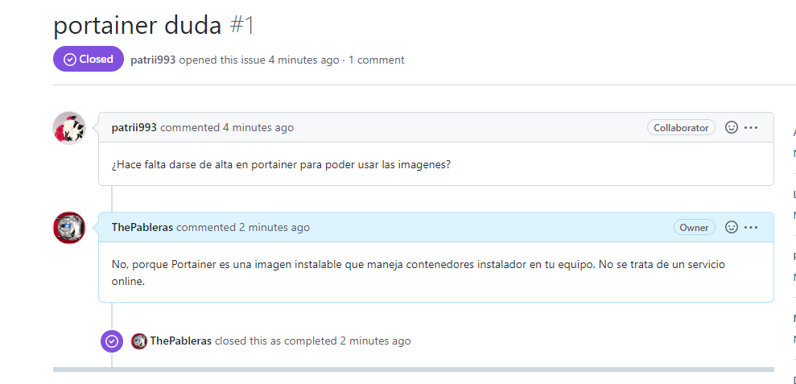

- A las 11:12 subo el trabajo realizado y el daily a mi rama para poder continuar posteriormente.

## Viernes 03/02/2023
- A las 8:40 nos disponemos a continuar con el trabajo del miércoles. Naturalmente, como es Lunes patricia va a realizar su trabajo en casa.

- A las 8:55 contento el issue de Emilio.
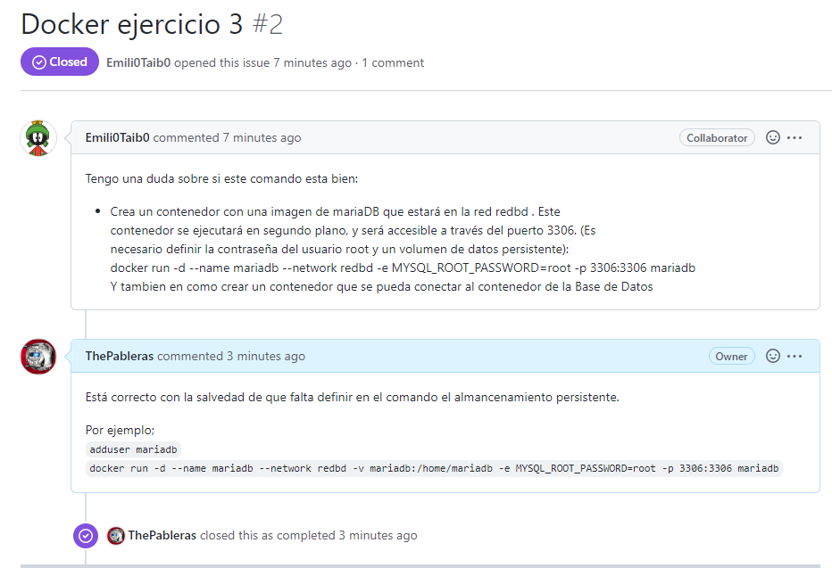

- A las 9:10 termino la primera parte del ejercicio y creo un pull request, de forma que mis compañeros puedan revisarlo.
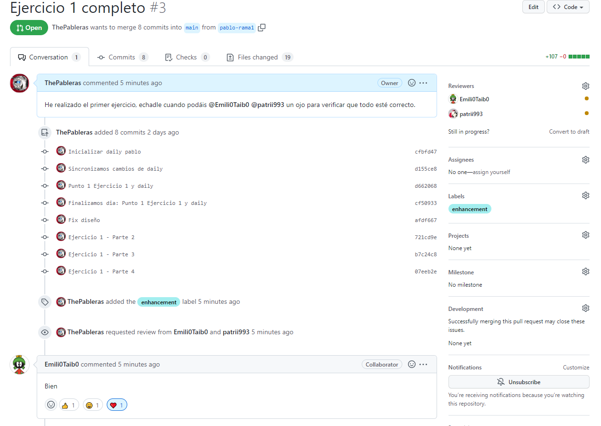

- A las 9:20 contesto un pr de Emilio.
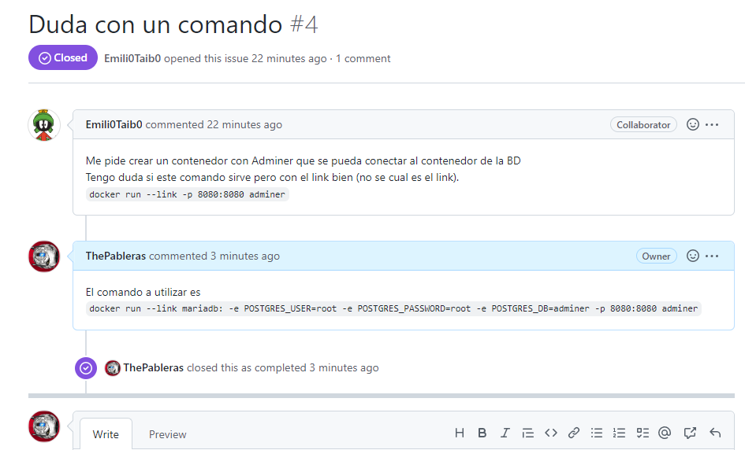

- A las 9:55 termino la parte de BD de mi ejercicio 1 y lo subo al pull request actual.

- A las 9:58 despues de finalizar mi ejercicio, cambio a la rama pablo-rama2 para continuar con un nuevo ejercicio.

## Lunes 06/02/2023
- A las 13:40 procedo a explicarle a Patricia los contenidos que hemos realizado el viernes pasado, ya que no pudo asistir a clase.

- Le comento a Patricia que revise mi pull request del ejercicio1, ya que Emilio ya lo ha revisado el pasado viernes.
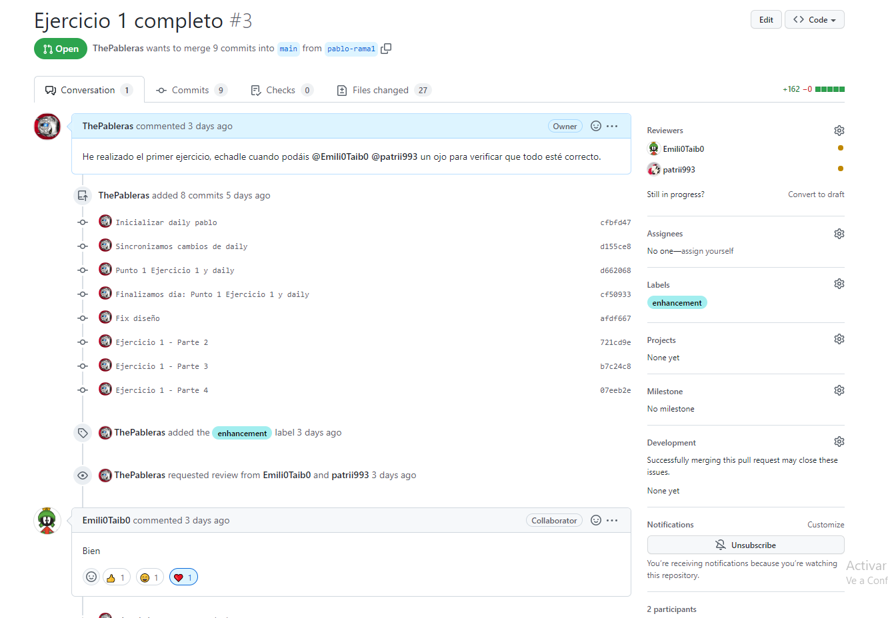

- A las 13:46 recibo el comentario de Patricia y procedo al mergeo de la tarea.

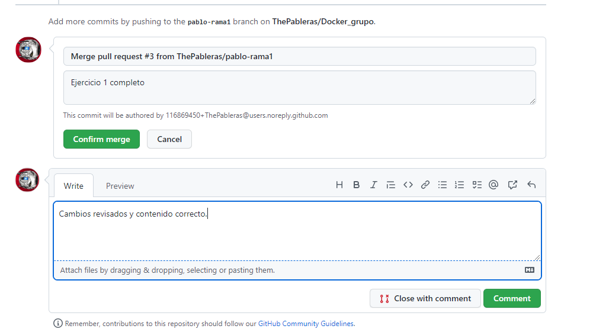

- A las 13:48 observamos que el merge se ha producido correctamente contra el main del repositorio.

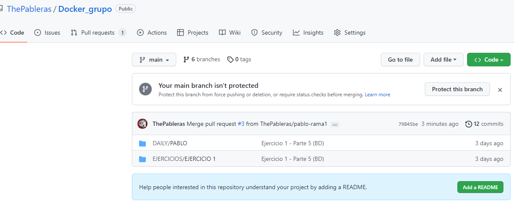

- A las 13:56 respondo el issue de Emilio.

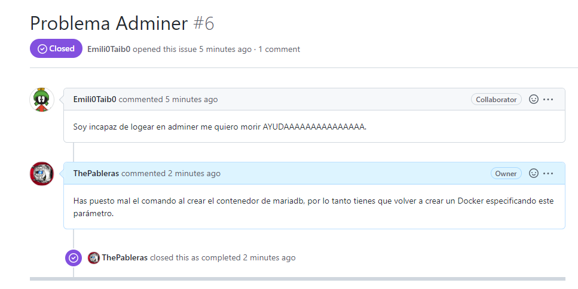

- A las 14:00 consensuamos que yo haré el ejercicio 4 de la tarea. Mientras Emilio continua haciendo el ejercicio 3 y Patricia el ejercicio 2.

- A las 14:25 guardamos cambios y subimos a github la rama actual en desarrollo.

## Miércoles 08/02/2023

- A las 9:40 continuamos con nustras actividades diarias.

- A las 10:14 termino mi ejercicio de Cmartrix (4) y procedo a subirlo con git.

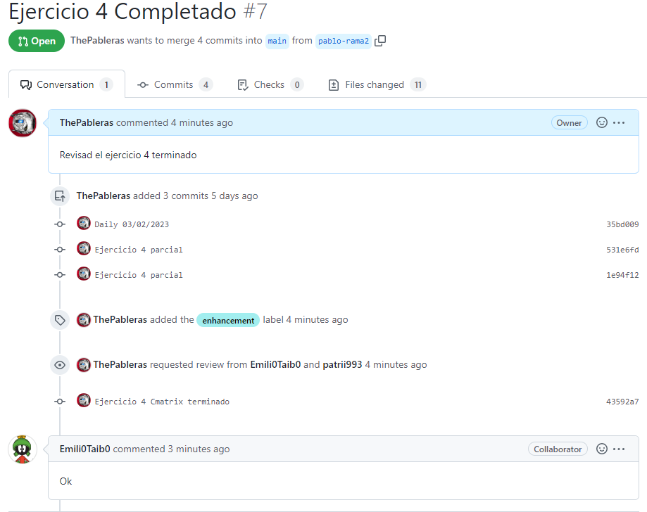

- A las 10:17 una vez Patricia revisa el contenido le comento que realice ella el merge del pull request para que se familiarice con Gihub.

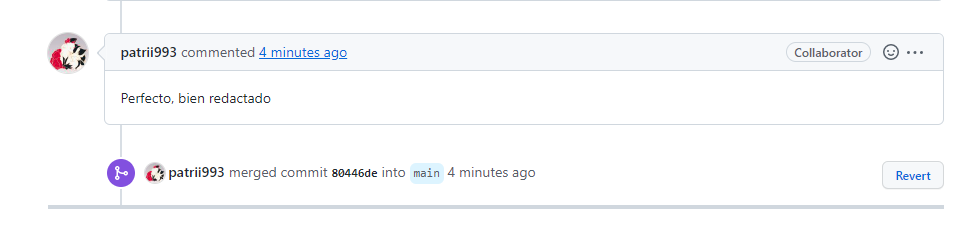

- A las 10:20 me dispongo a revisar el ejercicio 3 de Emilio ya que tenía dificultades. Para ello hago git pull y entro en su rama del ejercicio emilio-rama1 donde sigo trabajando.