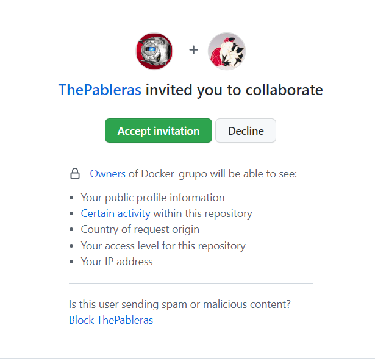

## Tarea Docker_grupo

> Realizado por Patricia Fdez

### Miercoles 01/02/2023

- 9.55 am:

Mi compañero Pablo R. me ha invitado a colaborar en el repositorio Docker_grupo.

- 9:58 am:
 
Acepto la colaboración el día 01/02/2023 a las 9.58 am  y comienzo con la organización del proyecto.

El jefe de proyecto, Pablo, ha organizado una estructura de carpetas para llevar un registro y de las actualizaciones diarias

:card_index_dividers:Docker_grupo -> :open_file_folder:DAILY -> 

### Lunes 06/02/2023 a las 13.41 am

Pablo y Emilio me ponen al tanto del avance del trabajo, ya que el viernes 03/02/2023 no pude asistir a clase.

- 13.44 am : 

Compruebo y comento el trabajo de Pablo.

- 13.46 am: 

Pablo hace merge pull request de su trabajo

- 14.22 
Hago git en el avance de la tarea.