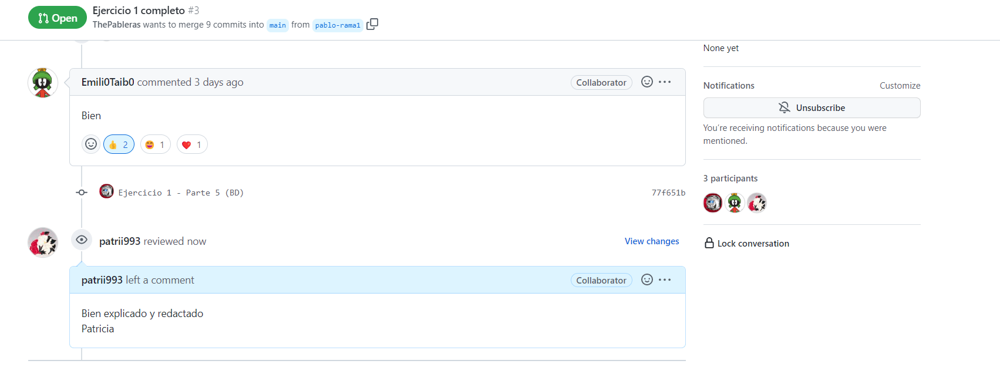

## Tarea Docker_grupo

> Realizado por Patricia Fdez

### Miercoles 01/02/2023

- 9.55 am:

Mi compañero Pablo R. me ha invitado a colaborar en el repositorio Docker_grupo.

- 9:58 am:
 
Acepto la colaboración el día 01/02/2023 a las 9.58 am  y comienzo con la organización del proyecto.

- 10.22 am:
Corrijo el main en GitHub y mi repositorio, ya que habia comenzado la estructura sin haberse planteado previamente.

El jefe de proyecto, Pablo, ha organizado una estructura de carpetas para llevar un registro y de las actualizaciones diarias

:card_index_dividers:Docker_grupo :arrow_right: :open_file_folder: DAILY :arrow_right: :open_file_folder: PATRICIA :arrow_right: :spiral_notepad: PatriciaFdez.md y :open_file_folder: assest

:card_index_dividers:Docker_grupo :arrow_right: :open_file_folder: EJERCICIOS :arrow_right: :open_file_folder: EJERCICIO 2 :arrow_right: :spiral_notepad: Ejercicio2.md y :open_file_folder: assest

- 10.55 am:

Creo un issue con una duda que me ha surgido, ya que no soy muy conocedora de que es portainer.

- 10.57 am:

Pablo, me responde y resuelve la issue.

### Lunes 06/02/2023 a las 13.41 am

Pablo y Emilio me ponen al tanto del avance del trabajo, ya que el viernes 03/02/2023 no pude asistir a clase.

- 13.44 am : 

Compruebo y comento el trabajo de Pablo.

- 13.46 am: 

Pablo hace merge pull request de su trabajo

- 14.22 am:

Hago git en el avance de la tarea, para guardar los cambios.

- 16.28 pm: 

Actualizo y corrijo el archivo daily.

- 18.09 pm:

Actualizo el ejercicio 2

### Miércoles 08/02/2023

-9.40 am
En clase de despligue, retomo el ejercicio 2.

- 10.16 am

Le confirmo el pull request a Pablo del ejercicio 4

- 10.48 am 

Le confirmo el pull request a Emilio del ejercicio 3

Y también confirmo el merge 

-10.52 am 

Finalizo el ejercicio 2
