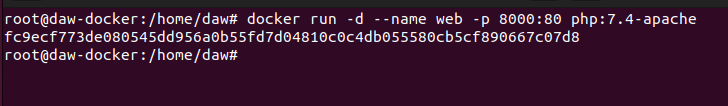

# Ejercicio 1 - Trabajo con imágenes
> Realizado por Pablo R.

| Contenido | URL |
| -- | --|
| Docker PHP | https://hub.docker.com/_/php |
| Docker Port | https://docs.docker.com/config/containers/container-networking/ |

## Servidor web
- **Arranca un contenedor que ejecute una instancia de la imagen php:7.4-apache , que se
llame web y que sea accesible desde un navegador en el puerto 8000.**

    Consultamos la documentacion de Docker php-apache para verificar el comando a ejecutar.

    ```sh
        docker run -d --name web -p 8000:80 php:7.4-apache
    ```

    

    Creamos la imagen de docker php.
    


- **Colocar en el directorio raíz del servicio web ( /var/www/html ) un sitio web donde figure el nombre de los componentes del grupo.**

- **Colocar en ese mismo directorio raíz un archivo llamado mes.php que muestre el nombre del mes actual. Ver la salida del script en el navegador.**

- **Borrar el contenedor**
