# Ejercicio 1 - Trabajo con imágenes
> Realizado por Pablo R.

| Contenido | URL |
| -- | --|
| Docker PHP | https://hub.docker.com/_/php |
| Docker Port | https://docs.docker.com/config/containers/container-networking/ |
| Docker mariab | https://hub.docker.com/_/mariadb |

## Servidor web
- **Arranca un contenedor que ejecute una instancia de la imagen php:7.4-apache , que se
llame web y que sea accesible desde un navegador en el puerto 8000.**

    Consultamos la documentacion de Docker php-apache para verificar el comando a ejecutar.

    ```sh
        docker run -d --name web -p 8000:80 php:7.4-apache
    ```

    

    Creamos la imagen de docker php.

    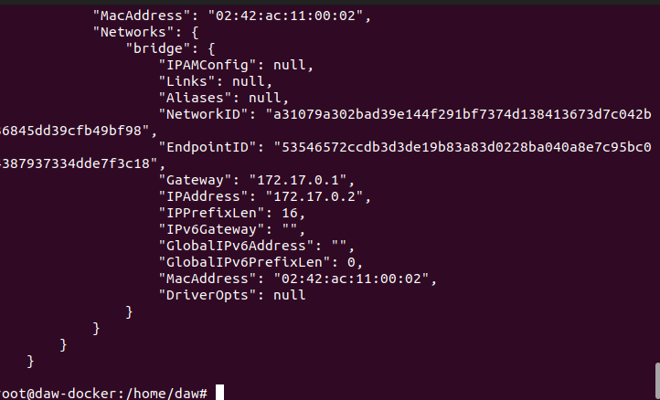
    
    Con docker inspect obtenemos la URL del contenedor.

    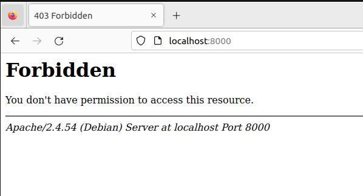
    
    Observamos que la web funciona. http://localhost:8000/


- **Colocar en el directorio raíz del servicio web ( /var/www/html ) un sitio web donde figure el nombre de los componentes del grupo.**

    ```sh
        docker start <id_contenedor>
        docker exec -it web <id_contenedor>
    ```

    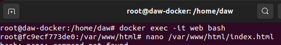

    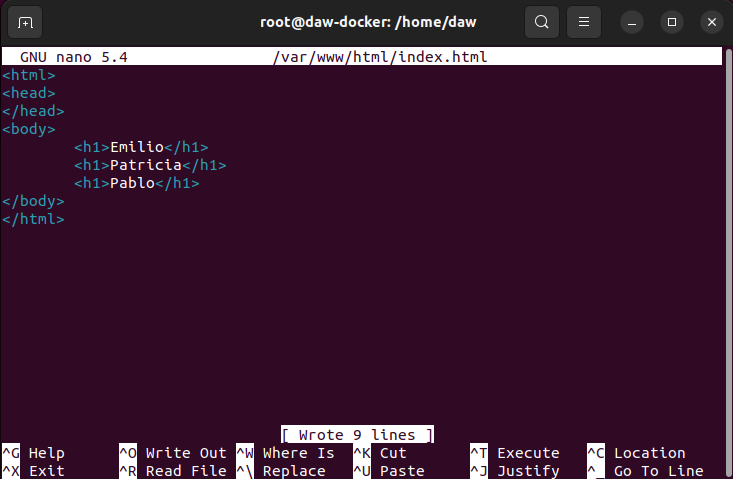

    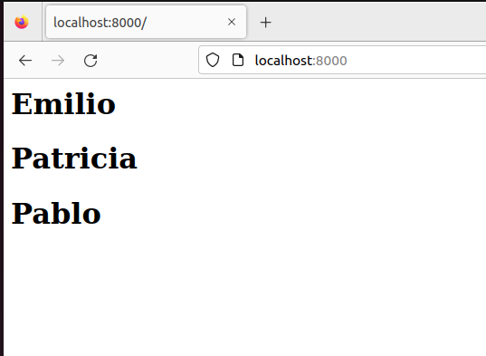

    Entramos en el contenedor y creamos el fichero index.

- **Colocar en ese mismo directorio raíz un archivo llamado mes.php que muestre el nombre del mes actual. Ver la salida del script en el navegador.**

    ```sh
        nano /var/www/html/mes.php
    ```

    ```php
    <?php
        echo date('F');
    ?>
    ```

    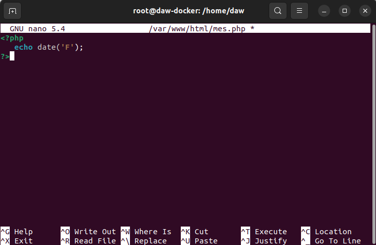

    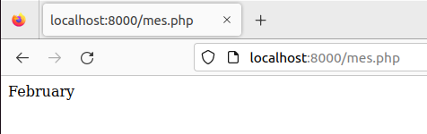

    Creamos el fichero de mes.php y lo visualizamos.

    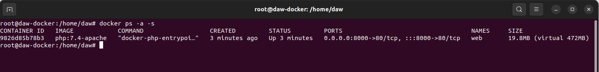

    Observamos el tamaño del contenedor en la situación actual.

- **Borrar el contenedor.**

    ```sh
        exit
        docker stop web
        docker rm web
    ```

    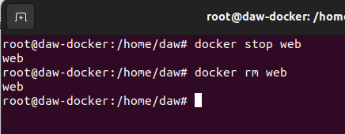
    
    Borramos el contenedor.

## Servidor de base de datos

- Arrancar un contenedor que se llame bbdd y que ejecute una instancia de la imagen mariadb para que sea accesible desde el puerto 3306.

- Antes de arrancarlo visitar la página del contenedor en Docker Hub y establecer las variables de entorno necesarias para que:
    - La contraseña de root sea root.
    - Crear una base de datos automáticamente al arrancar que se llame prueba.
    - Crear el usuario invitado con la contraseña invitado.

    ´´´sh
    docker run -d --name bbdd -p 3306:3306 --env MARIADB_USER=invitado --env MARIADB_PASSWORD=invitado --env MARIADB_DATABASE=prueba --env MARIADB_ROOT_PASSWORD=root  mariadb
    ´´´

    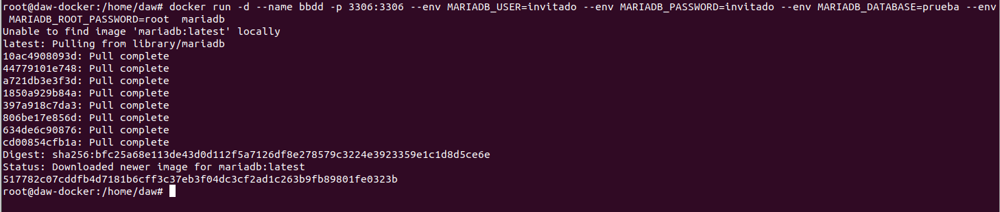

    Creamos el contenedor con los nombre de bd y usuarios solicitados.

    ### Instalacion de cliente de bd para acceder desde el host

    ```sh
    apt install mysql-client mariadb-client-core-10.6
    ```

    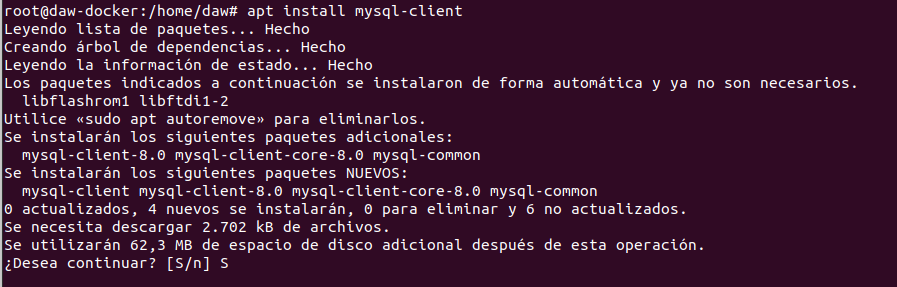
    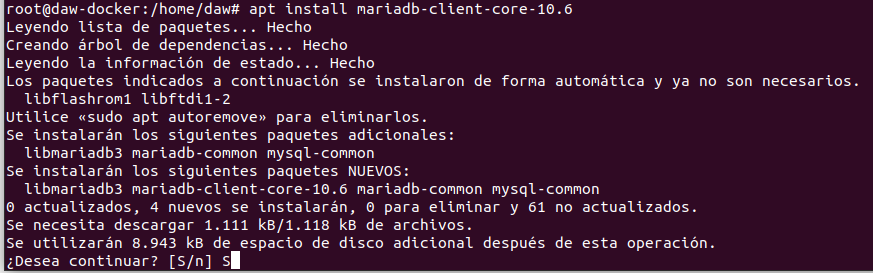

    Instalamos el cliente mysql en el host.

    ```sh
    mysql -h localhost --port 3306 --protocol TCP -u invitado -p
    ```

    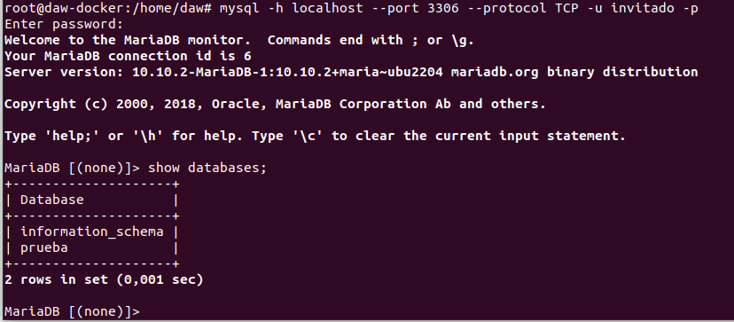

    ```sql
    show databases;
    ```

    Conectamos con la bd de datos con el cliente mysql y comprobamos que este creada la tabla prueba.

    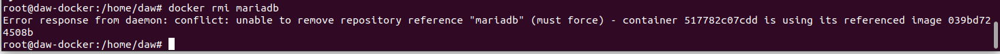

    Observamos que no podemos borrar la imagen con docker image rmi puesto que está en uso.