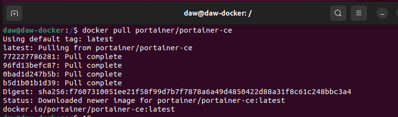
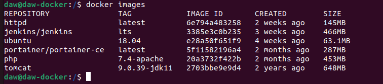
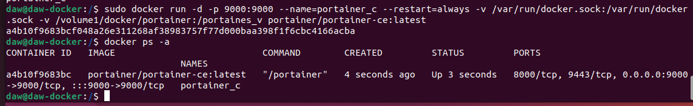

## Ejercicio 2 - almacenamiento - Portainer

> Realizado por Patricia Fdez

Descargo la imagen de portainer, la más actualizada es portainer/portainer-ce

```bash
docker pull portainer/portainer-ce
```


Compruebo que se ha descargado la imagen y esta en el repositorio.

```bash 
docker images
```


Creo un volumen para portainer y creo un contenedor le añadimos la imagen que descargamos y el volumen que acabo de crear

```bash
docker volume create portainer_v

docker run -d -p 80:80 -v  portainer_v:/var/www/html --name cont_p portainer/portainer-ce
```




