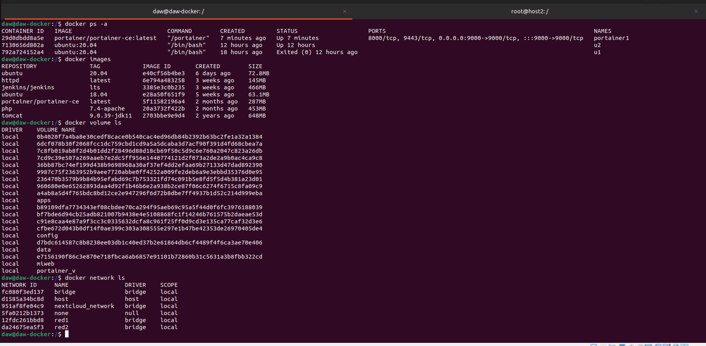

## Ejercicio 2 - almacenamiento - Portainer

> Realizado por Patricia Fdez

Descargo la imagen de portainer, la más actualizada es portainer/portainer-ce

```bash
docker pull portainer/portainer-ce
```


Compruebo que se ha descargado la imagen y esta en el repositorio.

```bash 
docker images
```


Creo un volumen para portainer y creo un contenedor le añadimos la imagen que descargamos y el volumen que acabo de crear.

```bash
docker volume create portainer_v

sudo docker run -d -p 9000:9000 --name=portainer_c --restart=always -v /var/run/docker.sock:/var/run/docker.sock -v /volume1/docker/portainer:/portaines_v portainer/portainer-ce:latest

```


La añado un directorio en el contenedor en el que irá el volumen y un puerto, en este caso 9000.

Abro el navegador y se muestra: 


Paro el contenedor, desde consola:


Compruebo en el navegador lo que muestra el contenedor parado.


Borro el contenedor, desde la consola


Vuelvo a crear un contenedor portainer, pero lo llamo portainer1

```bash
docker run -d -p 9000:9000 --name=portainer1 --restart=always -v /var/run/docker.sock:/var/run/docker.sock -v /volume1/docker/portainer:/portaines_v portainer/portainer-ce:latest
```
Me dirijo al navegador y me registro en portainer como admin para poder acceder a mi perfil:


Mi repositorio local contiene 7 imagenes, 6 redes, 20 volumenes y 3 contenedores


Comparo con la consola que lo que se muestra en el portainer va de acuerdo a mi repositorio.


Vuelvo a portainer y voy a los contenedores


Tengo dos activos y uno parado. Voy a parar un contenedor activo, el u2:


Procedo a borrar el contenedor u2: 


Una vez borrado el contenedor, creo un contenedor contenedor1, interactivo con imagen ubuntu:20.04:


Una vez finalizado el tratamiento con los contenedores voy al apartado donde están mis redes, y que contiene las siguientes: 


Procedo a borrar una red de mi repositorio, nextcloud_network:


Ahora procedo a crear una red portainer con las siguientes características:

Dirección de red: 172.20.0.0
Mascara de red: 255.255.255.0
Gateway: 172.20.0.1


Una vez finalizado con las redes, voy a mis volumenes y tengo estos los siguientes: 


Procedo a borrar un volumen creado por mi, en este caso el que se llama miweb:


Procedo a crear un volumen, al que llamo portainer1


## Bibliografía / Webgrafía

>  https://hdsplus.co/portainer-guia-de-instalacion-y-configuracion/#:~:text=Para%20acceder%20a%20Portainer%20deberemos,Docker%20en%20la%20siguiente%20pantalla.


