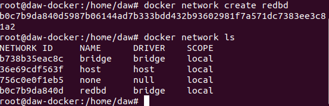

# Ejercicios Docker Grupo
> Realizado por: Emilio Taibo

## Ejercicos 3 - Redes

- Crea una red bridge redbd
~~~
docker network create redbd
~~~

- Crea un contenedor con una imagen de mariaDB que estará en la red redbd . Este
contenedor se ejecutará en segundo plano, y será accesible a través del puerto 3306. (Es
necesario definir la contraseña del usuario root y un volumen de datos persistente)
~~~
docker run -d --name mariadb --network redbd -e MYSQL_ROOT_PASSWORD=root -p 3306:3306 mariadb
~~~

- Crear un contenedor con Adminer que se pueda conectar al contenedor de la BD

- Comprobar que el contenedor Adminer puede conectar con el contenedor mysql abriendo
un navegador web y accediendo a la URL: http://localhost:8080