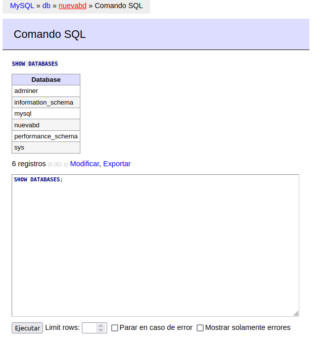

# Ejercicios Docker Grupo
> Realizado por: Emilio Taibo

## Ejercicos 3 - Redes

- Crea una red bridge redbd
~~~
docker network create redbd
~~~

- Crea un contenedor con una imagen de mariaDB que estará en la red redbd . Este
contenedor se ejecutará en segundo plano, y será accesible a través del puerto 3306. (Es
necesario definir la contraseña del usuario root y un volumen de datos persistente)
~~~
adduser mariadb
docker run -d --name mariadb --network redbd -v mariadb:/home/mariadb -e MYSQL_ROOT_PASSWORD=root -p 3306:3306 mariadb
~~~


- Crear un contenedor con Adminer que se pueda conectar al contenedor de la BD
~~~
docker run --network redbd --link mariadb:db -p 8080:8080 adminer
~~~

- Comprobar que el contenedor Adminer puede conectar con el contenedor mysql abriendo un navegador web y accediendo a la URL: http://localhost:8080


Accedemos con usuario y contraseña root, y nombre de la base de datos adminer.


Contenedores creados y en ejecución.


Acceso a la BD a través de Adminer.


Creación de BD con Adminer.


Observamos que la BD "nuevabd" se ha creado correctamente.


```sh
docker stop mariadb
docker rm adminer
docker rm mariadb
```

Borramos el contenido.
