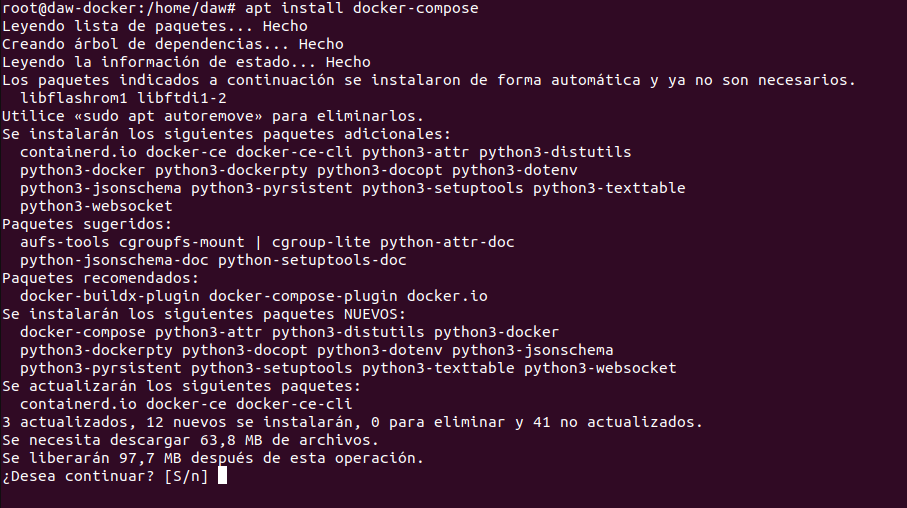

# Ejercicio 4 - Docker Compose
> Realizado por Pablo R.

| Contenido | URL |
| -- | --|
| Cmatrix | https://hub.docker.com/r/westonsteimel/cmatrix |

- Desplegar la aplicación cmatrix utilizando docker-compose.

```sh
apt install docker-compose
```

Procedo a instalador Docker compose ya que lo requiere el ejercicio.

```sh
nano /home/daw/docker-compose.yml
```

Creamos el fichero docker-compose con la config para levantar cmatrix.

Entregando los siguientes pantallazos y los comandos empleados para resolver el ejercicio:
- Pantallazo donde se vea el fichero docker-compose.yaml .
- Pantallazo donde se vea la aplicación funcionando. Se valorará conseguir el efecto
Greenrain.
- Explicar brevemente cómo funciona esta aplicación.
