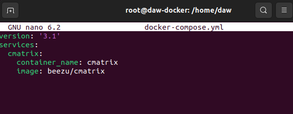
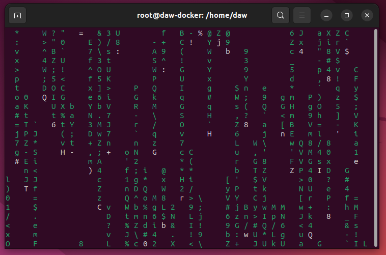

# Ejercicio 4 - Docker Compose
> Realizado por Pablo R.

| Contenido | URL |
| -- | --|
| Cmatrix | https://hub.docker.com/r/beezu/cmatrix |

- Desplegar la aplicación cmatrix utilizando docker-compose.

```sh
apt install docker-compose
```

Procedo a instalador Docker compose ya que lo requiere el ejercicio.

```sh
nano /home/daw/docker-compose.yml
```

Creamos el fichero docker-compose con la config para levantar cmatrix.

```yaml
version: '3.1'
services:
  cmatrix:
    container_name: cmatrix
    image: beezu/cmatrix
```



Usamos docker compose para ejecutar el contenedor.
```sh
docker compose run --rm cmatrix
```




Observamos que CMATRIX funciona. Se trata de una terminal con el efecto de matrix. La cortina va cayendo con los simbolos y letras.

Para volverlo a ejecutar simplemente usaríamos el comando de docker compose citado arriba para abrir el efecto.
