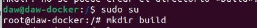
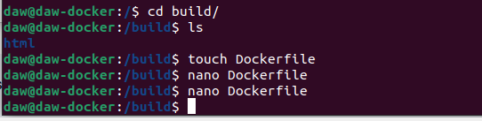
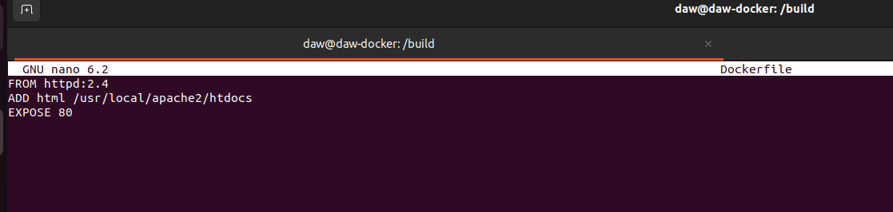

# Ejercicios Docker Grupo
> Realizado por: Emilio Taibo

## Ejercicos 5 - imagen con Dockerfile

### Crear una imagen con un servidor web que sirva un sitio web

- Basar la imagen en nginx o apache

- Desplegar una plantilla o un trabajo que tenga al menos, un index.html y una carpeta para estilos imagen, etc.

Primero creamos nuestro entorno de trabajo, una carpeta que incluira el archivo DockerFile y la carpeta con la plantilla web.

Nos metemos en el root

Le otorgamos permisos totales, para poder luego manipular la carpeta a nuestro antojo y así poder añadir la plantilla y para poder usar y acceder desde cualquier usuario.

Le cambiamos el propietario al usuario 

