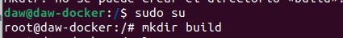
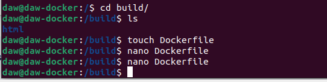
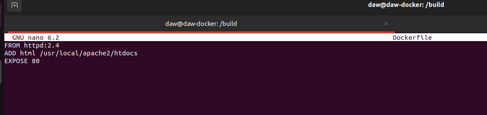
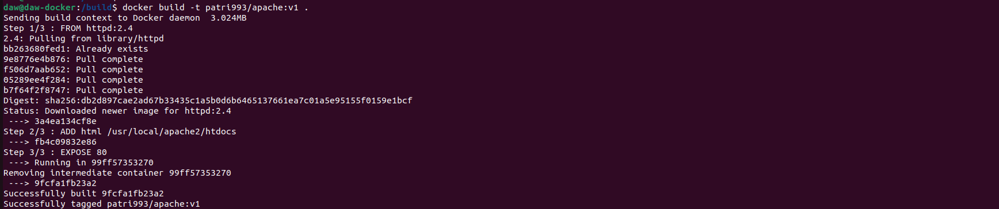
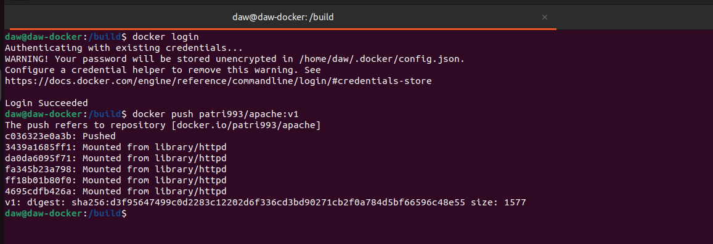
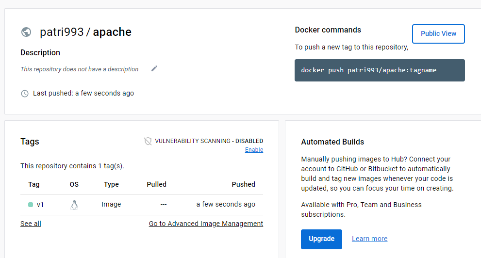
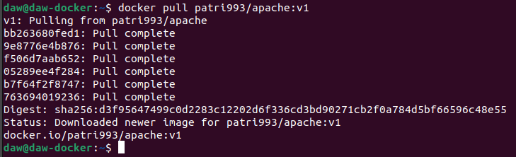
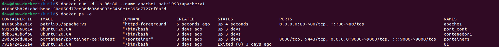
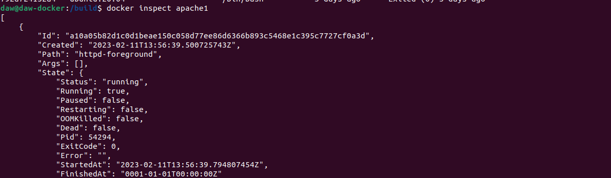
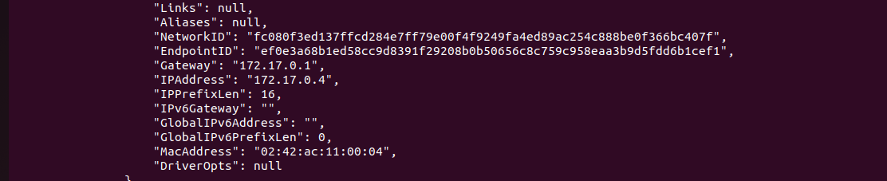

# Ejercicios Docker Grupo
<<<<<<< HEAD
> Realizado por: Emilio Taibo

## Ejercicos 5 - imagen con Dockerfile

=======

## Ejercicos 5 - imagen con Dockerfile

> Realizado por Patricia F. y Emilio

>>>>>>> 7255723565b7419f0ddb8c0a095a5761bcc33275
### Crear una imagen con un servidor web que sirva un sitio web

- Basar la imagen en nginx o apache

<<<<<<< HEAD
- Desplegar una plantilla o un trabajo que tenga al menos, un index.html y una carpeta para estilos imagen, etc.
=======
- Desplegar una plantilla o un trabajo que tenga al menos, un index.html y una carpeta para estilos imagen, etc.

Primero creamos nuestro entorno de trabajo, una carpeta que incluira el archivo DockerFile y la carpeta con la plantilla web.

Nos metemos en el root

```bash 
sudo su
mkdir build
```



Le otorgamos permisos accesos para todos los usuarios y le cambiamos el propietario.

```bash 
chmod 777 /build
``` 

```bash
chown -R www-data:www-data /build
```

Nos metemos dentro de la carpeta y creamos un fichero Dockerfile y metemos la carpeta que es la plantilla que usaremos.

```bash
cd build/
touch DockerFile
``` 



Escribimos el DockerFile:

```bash
nano DockerFile
```



FROM: la imagen que queremos usar, en este caso la de apache 
ADD: le indicamos la carpeta que queremos añadir, que es nuestra plantilla y he llamado html, y donde queremos que la añada. La pantilla contiene un index.htm al cual accederemos desde la url.
EXPOSE el puerto quiero que use, en este caso el 80

Guardamos y construimos la imagen. La llamamos patri993/apache:v1.

```bash
docker build - t patri993/apache:v1 .
```
**El punto final indica que el fichero Dockerfile está en la carpeta en la que estamos situados*



Subimos nuestra imagen a DockerHub.

Primero tenemos que loguearnos a DockerHub desde la consola

```bash 
docker login
```
y hacemos un push de la imagen

```bash
docker push patri993/apache:v1
```

la habiamos llamado así poniendole el nombre de nuestro DockerHub, el repositorio y la version.



Comprobamos que se ha subido correctamente:



El enlace al repositorio DockerHub

https://hub.docker.com/repository/docker/patri993/apache/general

Una vez subida la imagen, mi compañero podrá usarla para hacer el contenedor.

Desde su consola, se descarga la imagen para poder usarla: 

```bash
docker pull patri993/apache:v1
```



Ahora creamos un contenedor interactivo, que llamamos apache1, con la imagen descargada y con el puerto 80:80. 

```bash
docker run -d -p 80:80 --name apache1 patri993/apache:v1
```

Comprobamos que esté activado.

```bash
docker ps -a
```



Para poder acceder a nuestro página tenemos que comprobar cual es la ip asignada al contenedor:

```bash
docker inspect apache1
```




Y entramos en el navagador para comprobar que funciona, que enseña correctamente la plantilla:

```bash
172.17.0.4/index.htm
```


## Bibliografía

> https://www.josedomingo.org/pledin/2016/02/ejemplos-de-ficheros-dockerfile-creando-imagenes-docker/

> https://iescelia.org/ciberseguridad/serie-docker-como-crear-dockerfile/

> https://www.returngis.net/2019/02/publicar-tu-imagen-en-docker-hub/

> https://hub.docker.com/repository/docker/patri993/apache/general

